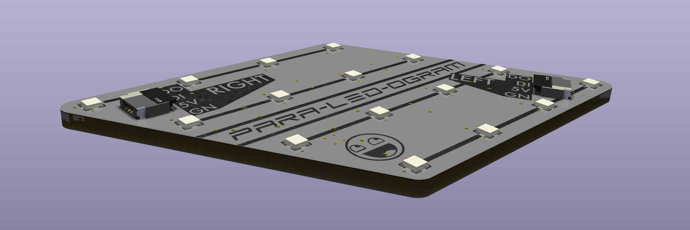
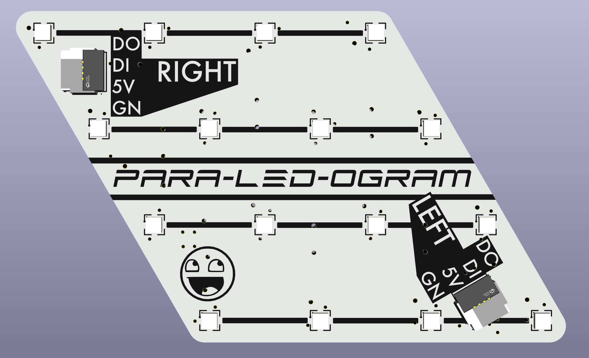
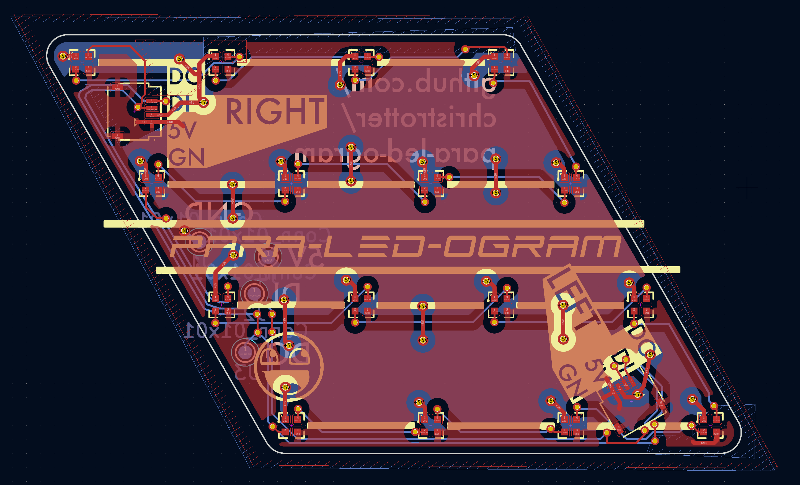
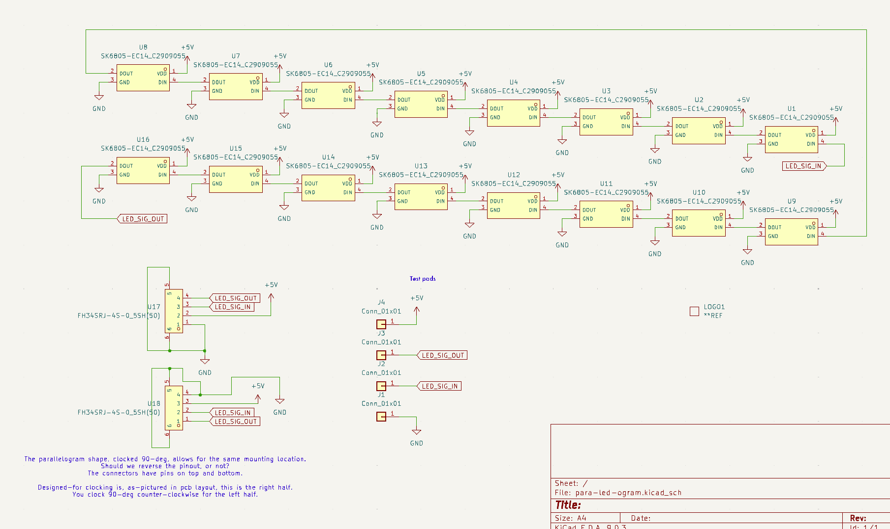

# para-led-ogram

- reversible for each split half
- paralellogram shape for more fun
- 16 RGB leds
- 4-pin 0.5mm-pitch 'top and bottom conductor' connector; pinout reversed for other half so you don't need to twist the FFC
- test pads

On the Arcboard mk22 I wanted the indicator bar to be a first-class RGB citizen, thus it got its own pcb.
Additionally, I wanted it to connect via FFC - and that required making it possible to plug in on both halves.

Future revisions will move to bottom-only conductors, and skip the reversed pinout - this created more confusion than it was worth.

